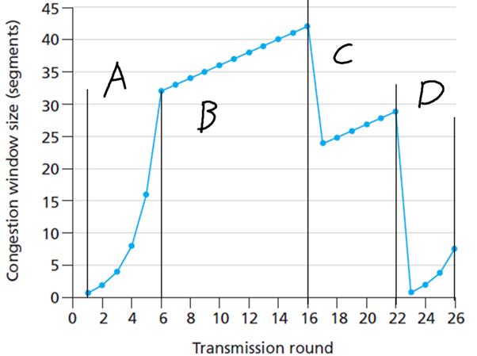
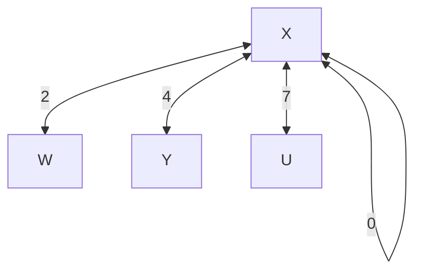
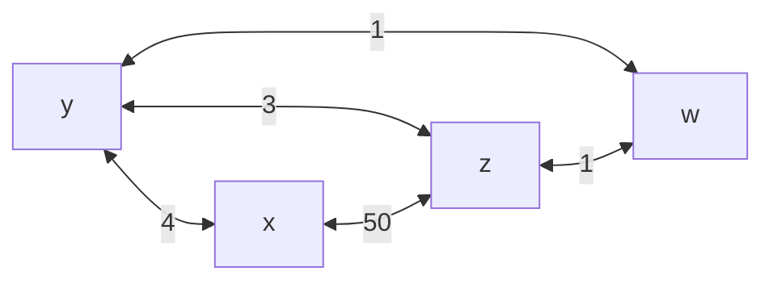
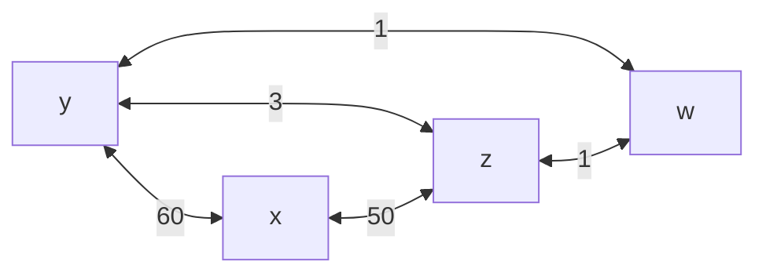

# Assignments
This is a collection of answers I personally wrote - **YMMV**.

Also, if you use this without understanding, it's your funeral.

## A1 Assignment 1 
### A1Q1 Question 1
> Why peer?
> Where does an IXP go in this?

The value of peering is that it allows for several major advantages: for ISPs that are not Tier 1 ISPs, that cannot reach all addresses, they are able to access content that exists on each other’s networks without having to go through an upstream Tier 1 provider, reducing the number of transmissions and bits needed per request.

Peering also provides additional routes for ISP networks to send packets to clients on each other’s networks, improving routing efficiency and fault-tolerance, since traffic can be routed through another ISP’s networks if one of the links goes down.

At the same time, ISPs and content networks need to agree to peer to one another, which is facilitated by the IXP. The IXP allows ISPs to directly link their networks to one another, which allows them to avoid having to pay to their upstream provider for transport. This allows them to transfer data between content networks and their own as well without needing an upstream provider.

### A1Q2 Question 2
> What is the E2E argument? How does it help? How does it fail?  

The end-to-end argument is that there is no practical reason for an application-level requirement to be met by a function acting on a lower networking level other than pure performance, and that any attempt otherwise fails to solve the problem fully.

This is shown in the example of end-to-end transmission of a large number of files consisting of many packets. Since each packet has to be transmitted to the socket for the lower layers to access, and processed through other sockets to be passed on, an attempt to ensure reliable transmission of packets at the lower transport layer only ensures that data is protected while in transit between network nodes, and not while being processed in each network node. This then necessitates a full check-and-error-correction be done anyway by the application at the receiving end, meaning that the link-layer checks are then merely a performance hit.

On the other hand, there are certain points wherein it is still valuable to have functions at the lowest levels despite it being application logic. In the two-generals problem, where two devices must agree to synchronize, it makes sense specifically to engineer an end-to-end solution in as many layers as possible, to ensure synchronicity of state as soon as possible with as little error as possible so that two hosts can then act on and advance their states accordingly, such as in P2P file-sharing.

## A2 Assignment 2
### A2Q1 Question 1
> Why UDP one socket when TCP two socket? How many sockets do TCP servers need for X client hosts? 

UDP only requires one socket because a UDP socket does not create a consistent connection – each datagram is not expected to channel data to-and-from a single source, but instead is labelled with a source that should be replied to. UDP does not handle socket multiplexing – all data is passed to the same socket, and the application layer is expected to handle things. 

TCP however processes data in a “pipe”, providing clients that connect to the server’s listener port with a separate socket which is then dedicated to each client’s TCP traffic.

A TCP server needs n+1 sockets to support n clients, as it needs to open a dedicated socket per client to receive messages.

### A2Q2 Question 2
> Consider the following ASCII Character string, captured by wireshark when browser sent a GET request:
> -snip-

> a. What is the URL requested?
> b. What version of HTTP?
> c. Persistent or non-persistent?
> d. What's the host IP?
> e. What browser? Why is this necessary?

a) Full: gaia.cs.umass.edu/cs453/index.html

b) HTTP 1.1

c) Persistent. (Connection: keep-alive)

d) gaia.cs.umass.edu: 128.119.245.12

e) Web-Browser: Netscape 7.2. The browser type is needed so that the server can identify what functionalities are available to the host, and provide an appropriate response.

## A3 Assignment 3
### A3Q1 Question 1
> Investigate TCP Reno.

A)	Slow Start: Section A as labelled above, rounds 0 – 6 – marked by exponential growth in congestion window. Section D, rounds 23-26 as well.

B)	Congestion avoidance: Section B, rounds 6 – 16 – marked by linear growth rate in congestion window. Similarly, we can see that in section C, rounds 17-22, the growth rate is linear as well – congestion avoidance.

C)	Segment loss is detected by triple duplicate `ACK` – Reno does not reset the congestion window to 0, but instead to roughly half of the previous window.

D)	Segment loss is detected by timeout – Reno resets the congestion window to 0.

E)	The `ssthresh` value is initially set to 32. We can see this as Reno swaps over to congestion avoidance at round 6, when the congestion window hits 32.

F)	It is 21. We know this since it immediately resumes congestion avoidance right after its fast retransmit.

G)	It is 32 once again, since segment loss timeout happens – this causes Reno to reset the `ssthresh` value to its default.

H)	It is sent at round 7. We know this since the cumulative total number of packets sent across the first 10 rounds are as follows:

|1|2|3|4|5|6|7|8|9|10
|-----|-----|-----|-----|-----|-----|-----|-----|-----|-----|
|1|3|7|15|31|63|96|130|165|201

Since 70 is greater than 64 but less than 96, we conclude that it must have been sent in round 7.

I)	Since the current congestion window size is 8, the `ssthresh` and congestion window will be set to 4. 

### A3Q2 Question 2
> Sending large file over TCP

a)	Since `cwnd` only increases by 1 MSS for each received round of ACKs, cwnd takes 6 RTTs to increase to 12 MSS:

$$
1 \space RTT \space each: 6 \rightarrow 7; 7 \rightarrow 8; 8 \rightarrow 9; 9 \rightarrow 10; 10 \rightarrow 11; 11 \rightarrow 12
$$
Assuming that we start at 1 MSS, over the course of the 6 RTT, we will have sent a total of `1+2+3+4+5+6=21` MSS, an average throughput of 3.5 MSS per RTT.

### A3Q3 Question 3
> HOL blocking in routers

HOL blocking refers to “Head-Of-Line” blocking in a router, and occurs in a router’s input ports, when multiple input ports are attempting to write to the same output. 

Head-of-line blocking is a result of the limited transmission capacity of each output port, wherein line(s) of packets is held up at the input buffers because the router is busy transmitting from another of the inputs to the output port, holding up the transmission of the rest of the packets in the queue.

### A3Q4 Question 4
> IP Addressing

Each of the five PCs must make a DHCP request to the router to assign each of them an address. This is done by each of the hosts in the following order:

1.	Host PC broadcasts a `DHCP Discover` message to every other networked host.
2.	The DHCP Server (in our case, the wireless router) responds with the `DHCP offer` message to the host PC, offering an IP lease for the network to the host PC.
3.	Host PC sends a `DHCP request` message to the Server.
4.	Server sends a `DHCP ACK` to the Host PC, establishing the host’s lease for that IP address.

The wireless router must also use NAT – otherwise, it would not be able to address incoming packets to each of the individual hosts – instead having to pulse messages to all five of them at the same time, which is both insecure and troublesome. Additionally, since each host needs its own unique IP, and the ISP only supplies one dynamic IP, it is impossible for all five hosts to have the same IP.
 
### A3Q5 Question 5 
> Forwarding & OpenFlow

a) A destination-based forwarding table contains only the necessary entries for the next-hop, the distance from the final destination, and where the final destination is. However, an OpenFlow table also contains an additional entry called `actions` which do more than just forwarding – it contains instructions for the router to execute actions on the packet (including intentionally dropping the packet).

b) Routing Table:

|Destination|Distance|Next-Hop|
|-----|-----|-----|
|H1|0|2|
|H2|0|3|
|H3|3|3|

c) Forwarding Table:

|Source|Destination|Next-Hop|
|-----|-----|-----|
|H1|H2|2|
|H1|H3|3|
|H2|H1|1|
|H2|H3|4|
|H3|H1|1|
|H3|H2|2|

d) Flow Table:

|Port|MAC Src| MAC Dst | Eth type| VLAN ID| IP Src | IP Dst | IP Prot | TCP SPort | TCP DPort| Action|
|-----|-----|-----|-----|-----|-----|-----|-----|-----|-----|-----|
|*|*|*|*|*|H1|H3|*|*|*|3|
|*|*|*|*|*|H2|H3|*|*|*|4|

### A3Q6 Question 6
> Subnets

Total number of interfaces required: `60+90+12=162>128`

Hence, we know we need to have the entire range of the subnet. But thanks to longest-prefix matching, we can easily sub-assign blocks of the address:

|Subnet| # Addresses | Network Address|
|-----|-----|-----|
|Subnet 3|	$12 \rightarrow 2^4$ address space |223.1.17.0/28|
|Subnet 1|	$60 \rightarrow 2^6$ address space |223.1.17.0/27|
|Subnet 2|	$90 \rightarrow 2^7$ address space |223.1.17.0/24|

This arrangement allows each subnet the following addresses:

1)	Subnet 3: `223.1.17.1` to `223.1.17.16` (16 addresses)
2)	Subnet 1: `223.1.17.17` to `223.1.17.127` (110 addresses)
3)	Subnet 2: `223.1.17.128` to `223.1.17.255` (127 addresses)

### A3Q7 Question 7
> MTU and datagrams

Given that each datagram requires at minimum 20 bytes for IP, our `data MTU` is 480 bytes. Hence, we need to separate our datagram into $ceil( \frac{1600}{480})=4$ fragments. In these datagrams, we will have to set our fragment offset (which is in 8-byte chunks) accordingly:

|Fragment 1|Fragment 2|Fragment 3|Fragment 4
|-----|-----|-----|-----|
|0|60|120|180|

The identification numbers for all fragments will be identical (`291`), and every fragment except for the final (closing) fragment will be marked as being a fragment with the `FRAGFLAG` bit being set to 1.

### A3Q8 Question 8
> Hosts behind a NAT

a)	Assuming we start from the NAT not having sent any packets, it is trivial to count the number of unique hosts: we simply need to note down whenever the sequence of packet identifications suddenly changes, and then keep a running tally of the sequential numbers after – assuming that the distance between the random numbers is sufficiently large. Each set of sequences then indicates a unique host.

b)	It would not – we would be unable to detect any pattern in the identification numbers, which would make counting for the sequences impossible.

## A4 Assignment 4

### A4Q1 Question 1
> Distance vector routing

a)	X’s distance vectors:

Vectors:

b)	`C(x,w)` goes from 2 to 10. This causes the minimum-cost path to U to update to `(X,Y,U)` for a total cost of 11.

c)	`C(x,y)` goes from 5 to 4. This causes the minimum-cost path to U to remain the same – 7, with `X,W,U`.

### A4Q2 Question 2
> Poisoned reverse

Graph:

a)	Distance Values:

Router `z`:
-   Informs `w`: $Dz(x)= \infty$
-   Informs `y`: $Dz(x)= 5$

Router `w`:
-   Informs `y`: $Dw(x)= \infty$
-   Informs `z`: $Dw(x)= 5$

Router `y`:
-	Informs `w`: $Dy(x)= 4$
-	Informs `z`: $Dy(x)= 4$

b)	There will be a count-to-infinity problem, since the poisoned reverse only forces nodes that are used to route to a destination to not use the poisoned reverse for resolution but does nothing about 2nd-order links.

#### T0:
|Distance to:|W |X |Y| Z|
|----:|-----|-----|-----|-----|
|W|-|5|1|1|
|Y|1|9|-|2|
|Z|1|6|2|-|

Router `y` informs `z` that `D(X)` now costs infinity. Router `z` changes routing to prefer `w`. Route now costs `D(z,x) = D(w) + D(w,x)`. Router `w` retrieves route cost from `y`, which also now links to `x` via `w`, with a net cost of 9.

#### Round 1:
|Distance to:|W |X |Y| Z|
|----:|-----|-----|-----|-----|
|W|-|11|1|1|
|Y|1|14|-|2|
|Z|1|10|2|-|

Router `w` informs `y` that `D(w,x)` is now infinity; Router `y` now prefers `z` to link to `x`, since it only sees that `z` doesn't use itself as a next-hop. It derives `D(y,x) = D(y,z) + D(z,x) = 15+2`. 

Router `z` informs `w` that `D(z,x)` is now infinity; Router `w` now prefers `y` to link to `x`, since it only sees that `y` doesn't use itself as a next-hop. It derives `D(w,x) = D(w,y) + D(y,x) = `. 

Router `y` informs `z` that `D(y,x)` is now infinity; Router `z` now prefers `w` to link to `x`, since it only sees that `w` doesn't use itself as a next-hop. It derives `D(z,x) = D(z,w) + D(w,x) = `. 

#### Round 2:
|Distance to:|W |X |Y| Z|
|----:|-----|-----|-----|-----|
|W|-|16|1|1|
|Y|1|19|-|2|
|Z|1|15|2|-|

Router `w` informs `z` that `D(w,x)` is now infinity; Router `z` now prefers `y` to link to `x`, since it only sees that `y` doesn't use itself as a next-hop. It derives `D(y,x) = D(z,y) + D(y,x) = `. 

Router `z` informs `y` that `D(z,x)` is now infinity; Router `y` now prefers `w` to link to `x`, since it only sees that `w` doesn't use itself as a next-hop. It derives `D(w,x) = D(y,w) + D(w,x) = `. 

Router `y` informs `w` that `D(y,x)` is now infinity; Router `w` now prefers `z` to link to `x`, since it only sees that `z` doesn't use itself as a next-hop. It derives `D(w,x) = D(w,z) + D(z,x) = `. 

#### Round 3:
|Distance to:|W |X |Y| Z|
|----:|-----|-----|-----|-----|
|W|-|21|1|1|
|Y|1|24|-|2|
|Z|1|20|2|-|

... etc etc.

### A4Q3 Question 3
> OSPF, BGP

a)	Router 3 hears of x by eBGP, since the routing path is for a router that is outside of its own AS.

b)	Router 3a hears of x by iBGP, since 3c, after receiving the eBGP signal, would convert it to iBGP for the other routers within its own AS.

c)	Router 1c learns of x by eBGP, since 3a transmits it to 1c, which is in another AS, by eBGP.

d)	1d learns of x by iBGP, since 1c transmits internally with iBGP and 4a is in another AS.

e)	It will be set to l1, since the shortest open path available (by cost) is through l1.

f)	It will be set to l2, since l2 now has the shortest open path available (4 vs 3).

g)	It will be set to l1, since l1 has the shortest path available (the intra-net of an AS is not available to 1d) with only 2 AS transits.

### A4Q4 Question 4
>Network Switch / Router

a)	No it will not, since when host E sends the IP datagram, S3 will flood the rest of its links for the MAC address of F, and since F is directly connected to S3, it will reply and the message will be sent to F directly through S. Also, the source IP will be that of host E, as will the MAC address, and the destination IP will be F’s IP address while the MAC address is that of the broadcast MAC (FF-FF-FF-FF-FF-FF). 

Alternately, if E checks the IP prefix (and we assume it knows F’s Mac address), it will realise that F is in its subnet, and will directly message it instead (hence the destination MAC address will be F’s)

b)	E will perform an ARP query, but it will get the first-hop router R1’s address instead. This is so that E knows which address to send to in order to get to host B. In the Ethernet frame, the source IP and MAC address are E’s, but the destination IP is B’s and the MAC address is the broadcast MAC.

c)	S0 will flood all connections with the ARP request, but S1 will reply with the MAC address of B, and so will host B, stopping the flooding of the request. R1 will never receive this ARP request in the first place, and since the ARP request already contains the source MAC of the sender, B will not send an ARP query message, and S1 will not receive the ARP response message from B, since S0 already knows where the address of host A is.
